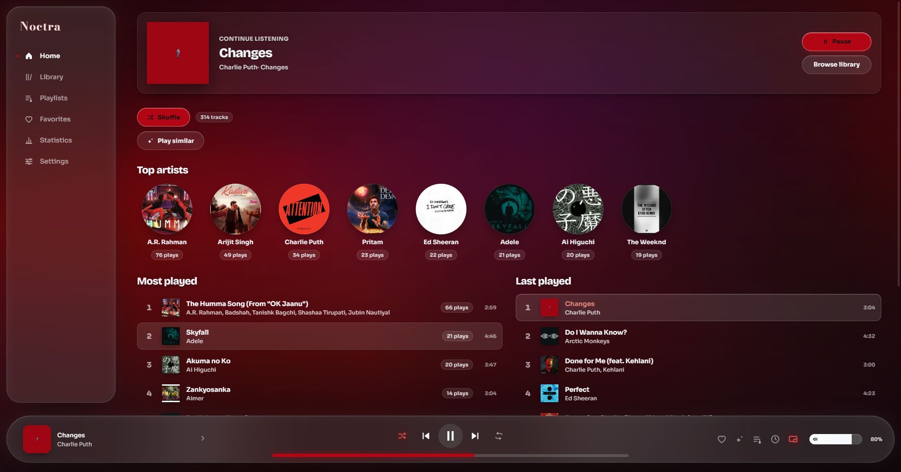
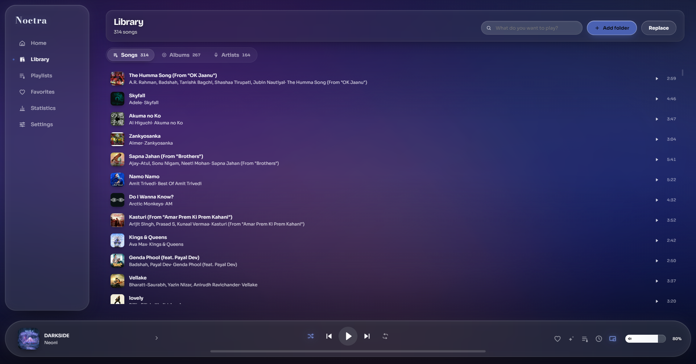
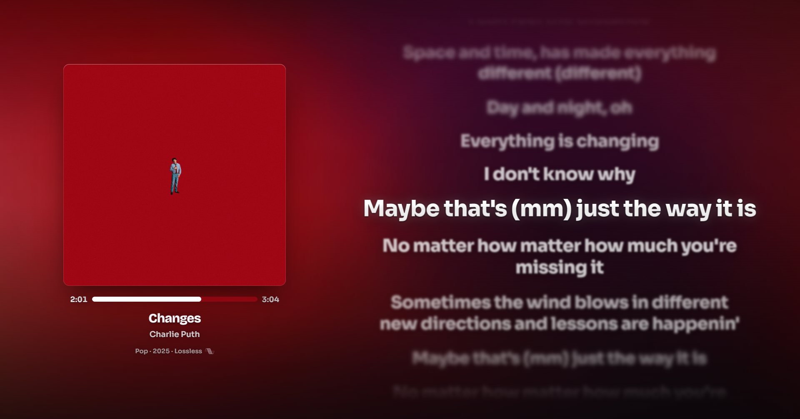
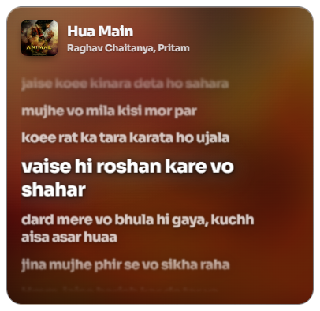
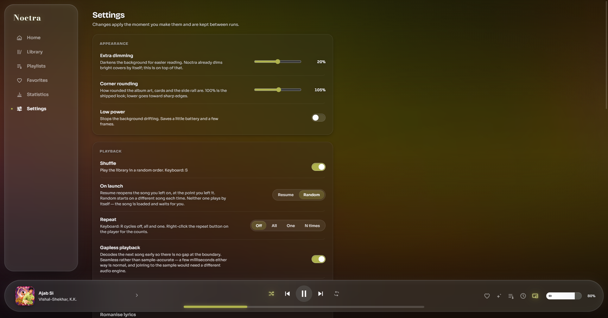

<div align="center">

# 🌙 Noctra

**An offline-first desktop music player that gets out of your way.**

Your files, your tags, your artwork — no account, no telemetry, no streaming service deciding
what you're allowed to hear. Point it at a folder and it plays your music lossless, and looks the
way the artwork says it should.



</div>

---

## 📥 Download

**[Get the latest release →](https://github.com/Soutrik-Debnath/Noctra/releases/latest)**

Grab `Noctra_1.0.0_x64-setup.exe`, run it, done. Windows 10 or 11, 64-bit. No runtime, no
dependencies, and it never needs the internet unless you ask it for lyrics.

The installer is unsigned, so SmartScreen will say *"Windows protected your PC"* the first time —
click **More info → Run anyway**. That's a missing certificate, not a problem with the build.

---

## ✨ What it does

### 🎵 The library is real
Scans **FLAC, MP3, M4A, AAC, OGG, WAV and MP4**, reads the actual tags with
[`lofty`](https://crates.io/crates/lofty), and pulls embedded cover art out of the file —
JavaScript tag libraries are unreliable for FLAC and OGG artwork, so that part is done in Rust.
Songs, albums and artists come from what your files say, not from a guess, and the scan is
streamed so a few hundred albums never freezes the window.



### 🎨 The interface takes its colour from the record
Every accent — progress fill, active nav dot, sliders, the glow behind the artwork — is sampled
from the cover that's currently playing and interpolated across the whole UI on a 500ms
transition. Press play on a blue album and the app goes blue. Press play on a red one and it
follows.

> The one rule this is built on: **on/off state is carried by lightness, never by hue alone.**
> The accent is sampled from the cover, so on a grey sleeve there is no "accent colour" to
> distinguish anything with. States that matter survive a colourless cover.

### 📝 Lyrics that actually keep up
Synchronised lyrics with **word-level timing**, from your own `.lrc` sidecars, embedded tags, or
[LRCLIB](https://lrclib.net) — the only thing in the app that reaches the network, and only when
you ask for it. A scrollable reel you can click to seek, romanisation for Hindi, Bengali and
Gujarati, and a timing offset you nudge *while the words are on screen*, because sending you to a
different page to adjust something you have to see means adjusting it blind.



### 🪟 A desktop mini player, not a shrunken window
A floating always-on-top card that mirrors the full screen: same artwork, same synced lyrics, same
transport. Its artwork grows out of the thumbnail on hover instead of cross-fading in place. It's a
separate window rendering a snapshot of shared state and sending its presses back as commands, so
playback still lives in exactly one place and the two surfaces can't disagree.



### 🔇 No gap between songs
Two audio decks, not one. The next track is decoded early so the boundary is silent-free, and an
optional **crossfade of 0–12 seconds** overlaps the outgoing and incoming song. Gapless is on by
default; crossfade starts at zero, so nothing about how it sounds changes until you deliberately
move that slider.

The handoff is driven by a pure decision function with unit tests, because the two ways this goes
wrong are both silent: a second deck feeding the position clock double-counts listening time, and
the outgoing deck's `ended` event skips a track mid-fade.

### 📌 Windows actually knows you're playing music
Native taskbar thumbnail buttons, system media controls, and a window title that reads
`Track - Artist` so it shows up correctly in alt-tab and every media overlay on the desktop.

### ❤️ A favourite button you can see
The heart is **half the size of the artwork**, centred on the sleeve, because a control you have to
hunt for isn't the centrepiece. Un-liking something breaks it in two along an irregular fracture,
and the halves fall away.

### 🔊 The rest of it
- **Playlists** you build, plus **Favorites**, **blocked tracks** and **bookmarks**
- **Queue** with drag to reorder, and a "play next" that seeds up-next from the list you clicked
- **Play similar** — same album, same artist, shared genre, and tracks you always queue next to
  each other. No model, no embeddings; just the honest signals from what you actually play
- **Sleep timer**, including "stop after this song"
- **Repeat** as off / one / all / *n* times
- **Command palette** on `Ctrl+K`, and full keyboard control
- **Statistics** — plays, listening time, top artists, all stored locally



---

## 🧱 How it's built

| | |
|---|---|
| **Shell** | [Tauri 2](https://tauri.app) + Rust |
| **UI** | Svelte 5 (runes) + TypeScript + Vite |
| **Audio** | `HTMLMediaElement`, streamed over a custom `noctra-audio://` protocol |
| **Tags** | [`lofty`](https://crates.io/crates/lofty) in Rust |
| **Type** | Manrope, self-hosted and variable |
| **Runtime deps** | **Two.** |

Two deliberate constraints shape the whole thing:

**It must work with no network at all.** Fonts are bundled, not fetched. Lyrics come from your
files, or from LRCLIB and are cached. Nothing reaches out at runtime that you didn't ask for.

**It stays small.** No component library, no state library, no router, no icon package — icons are
a local path registry rendered by one 35-line component, and the installer is a couple of
megabytes. The visual language (glass blur, rim depth, specular edges) was measured pixel-by-pixel
off reference captures at 5× zoom rather than picked by taste.

---

## 🚀 Getting started

### Download
Grab the installer from the [latest release](https://github.com/Soutrik-Debnath/Noctra/releases/latest)
— `Noctra_1.0.0_x64-setup.exe`.

### Build from source

```bash
# prerequisites: Node 18+, Rust (stable), and the platform build tools for Tauri
npm install
npm run tauri dev      # development, hot reload
npm run tauri build    # production installer
```

Output lands in `src-tauri/target/release/bundle/`.

---

## 🗺️ What it does *not* do yet

Honesty over a longer feature list. These are designed but not shipped:

- 🎚️ **Parametric EQ** — six bands with presets and a bass control. Designed, not built yet.
- 📥 **Watching folders** — you rescan manually today.

---

## 📄 License

[MIT](LICENSE) — do what you like, keep the credit line.
